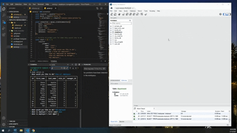
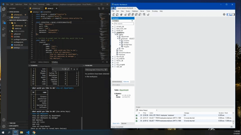

<div align="center">

# Employee-Management-System

Built with Node.js, Inquirer npm, MySQL

URL of the GitHub repository: https://github.com/TomFallon9/employee-management-system

</div>

## Table of Contents 

* [Description](#description)
* [User Story](#user-story)
* [Installation](#installation)
* [Usage](#usage)
* [Built With](#built-with)
* [License](#license)

## Description

This command line application allows user to easily view and manage the departments, roles, and employees in their company.

### User Story

As a business owner, I want to be able to view and manage the departments, roles, and employees in my company, so that I can organize and plan my business.

## Installation

User can clone this repository, make sure to have Node and MySQL installed. 

Dependencies are [Inquirer](https://www.npmjs.com/package/inquirer) for collecting input from the user and [MySQL](https://www.npmjs.com/package/mysql) to connect to the MySQL database and perform queries. To install the dependencies, run the following command:
```
npm i
```

## Usage

Using this application, the user is able to do the following:
* Add departments, roles, employees 
* View departments, roles, employees 
* Update employee roles 
* Update employee managers 
* View employees by manager 


Before running the command below, the [schema.sql](https://github.com/TomFallon9/employee-management-system/blob/main/db/schema.sql) script should be executed in MySQL Workbench in order for the user to connect to the database. 
If you would like some starter data to demo your table you can add [seeds.sql](https://github.com/TomFallon9/employee-management-system/blob/main/db/seeds.sql) to your Workbench or Tableplus.

The application will be invoked with the following command:
```
node server.js
```


<p></p>

<p></p>


## Built With

* [Node.js](https://nodejs.org/en/) - An open-source JavaScript runtime environment that executes JavaScript outside of the browser. 
* [MySQL](https://www.mysql.com/) - A database management system that is based on SQL – Structured Query Language.
* [Inquirer](https://www.npmjs.com/package/inquirer)

## License

Copyright 2021 Thomas Fallon

Licensed under the [MIT License](https://opensource.org/licenses/MIT)
